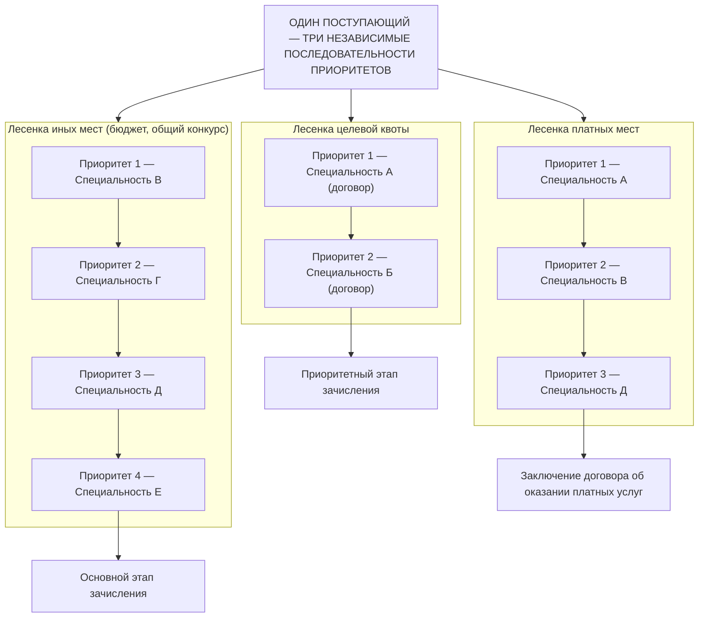
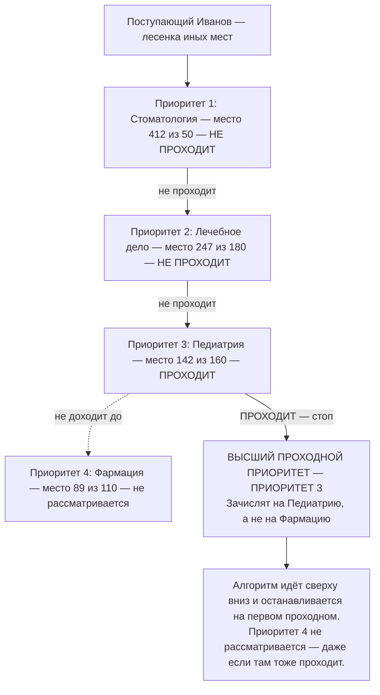
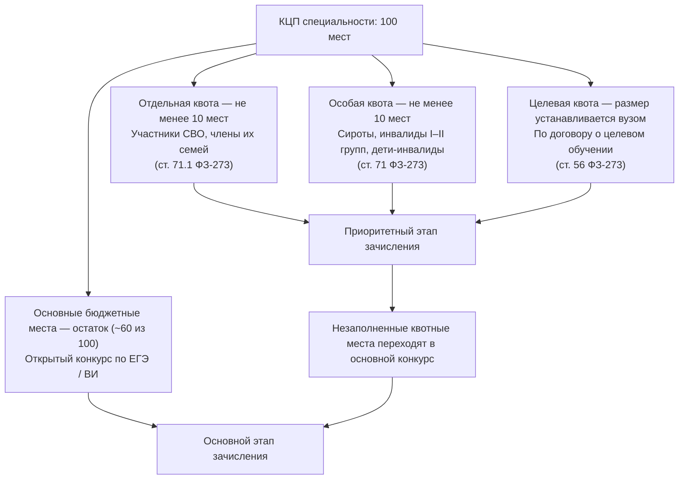
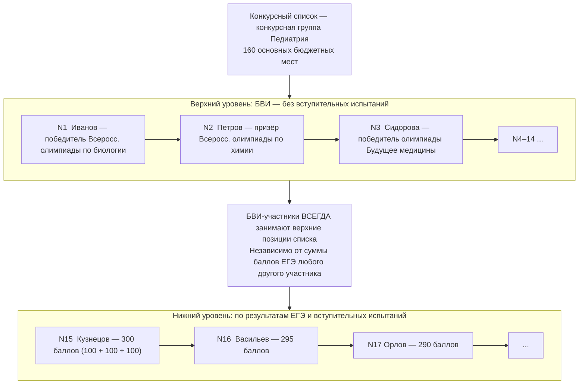
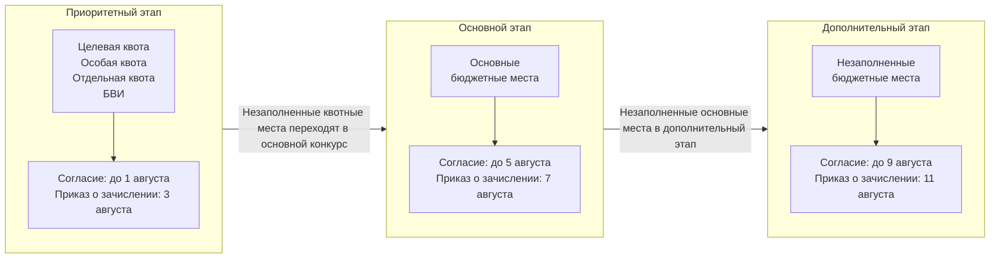
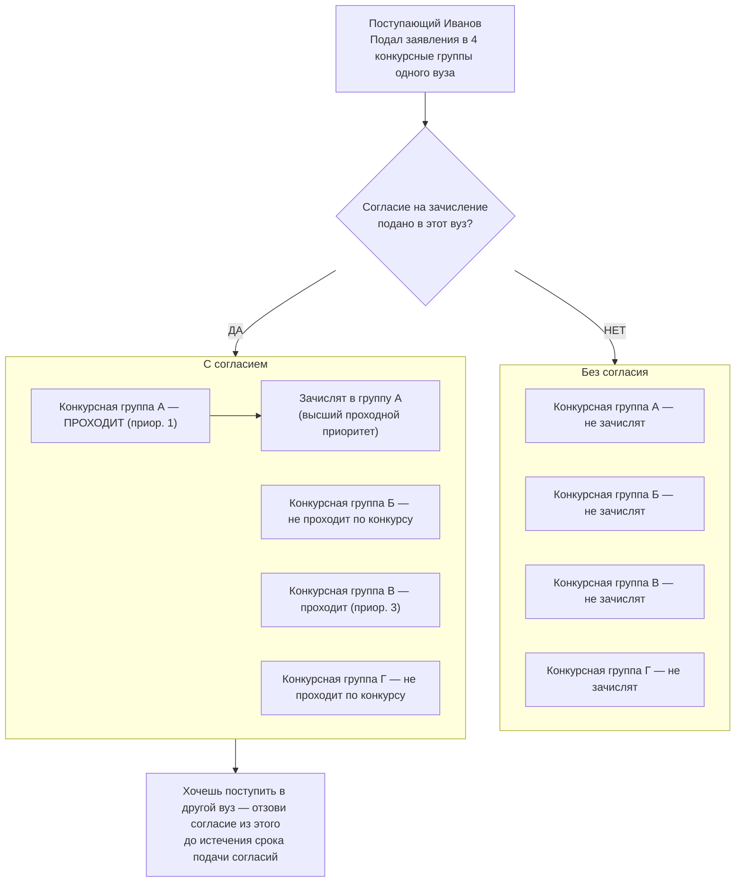
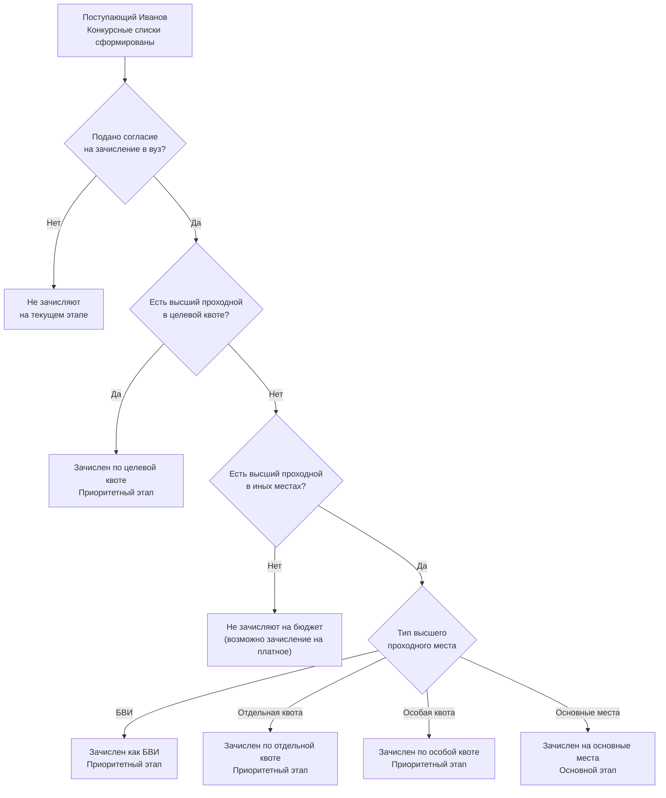

# Визуализации: система приоритетов и конкурсного отбора при приёме на программы ВО 2026/27

**Домен:** D05 · **Тип:** лучшая практика — инфографика  
**Нормативная основа:** Приказ Минобрнауки России от 27.11.2024 № 821  
**Применимость:** ВУЗ  
**Аудитория:** разработчики ИС, сотрудники приёмных комиссий, кураторы целевого обучения

---

Серия диаграмм закрывает концептуальные провалы понимания системы приёма 2024+.
Каждая диаграмма посвящена одной ловушке понимания, а не «всему сразу».

Сквозной персонаж «Иванов» — один условный поступающий, появляющийся
в диаграммах 2, 6 и 7. Накапливайте контекст: это один и тот же человек.

Дизайнерские ТЗ к этим диаграммам — в `infographics-brief.md` (корень репозитория).

---

## Диаграмма 1. Три лесенки приоритетов

**Закрывает ловушку:** «приоритеты — это один список от 1 до 5».

Один поступающий ведёт три независимые нумерации приоритетов. Нумерация
в каждой последовательности начинается с 1. Смешать целевую квоту и
общий конкурс в одной нумерации нельзя.

**Поступающий не может смешать целевую квоту и общий конкурс в одной нумерации.
Это три разных конкурса с разными этапами зачисления.**

---

## Диаграмма 2. Высший проходной приоритет

**Закрывает ловушку:** «зачислят на тот приоритет, что я поставил первым».

Иванов подал заявление на четыре специальности (лесенка иных мест).
Алгоритм проходит лесенку сверху вниз и останавливается на первом проходном.

**Зачислят не туда, куда поставил первым, — а на самый высокий из тех
приоритетов, где прошёл по конкурсу.**

---

## Диаграмма 3. Иерархия квот

**Закрывает ловушку:** «квоты — это что-то про льготников, меня не касается».

КЦП специальности делится на несколько частей. На открытый конкурс
поступает меньше половины мест. Целевая квота — отдельный, менее
конкурентный путь с собственным этапом зачисления.

**На открытый конкурс реально поступает около 60% мест.
Целевая квота — отдельный конкурс с меньшим числом участников и собственным этапом.**

*Примечание: точный размер целевой квоты устанавливается образовательной
организацией в правилах приёма. Нормативный минимум для отдельной и особой квот —
10% от КЦП (Приказ № 821, ФЗ-273).*

---

## Диаграмма 4. Два этажа конкурсного списка

**Закрывает ловушку:** «олимпиадник со 100 баллами ЕГЭ и стобалльник ЕГЭ равноценны».

Конкурсный список одной конкурсной группы жёстко разделён на два уровня.
Участники БВИ всегда занимают верхние позиции — независимо от баллов.

**Стобалльник ЕГЭ стоит на 15-м месте, потому что выше него 14 олимпиадников.
Это правило ранжирования, установленное Порядком приёма, — не исключение.**

---

## Диаграмма 5. Этапы зачисления как фильтр

**Закрывает ловушку:** «зачисление — это один день».

Зачисление проходит в три последовательных этапа с независимыми дедлайнами.
Незаполненные места переходят на следующий этап.

**Пропустить дедлайн согласия на приоритетном этапе — значит перейти
в основной этап, где меньше мест и выше конкуренция.**

*Примечание: даты установлены в соответствии с Порядком приёма (Приказ № 821 от 27.11.2024).
Точные сроки ежегодно публикуются в правилах приёма конкретной образовательной организации.*

---

## Диаграмма 6. Согласие на зачисление — глобальный сигнал

**Закрывает ловушку:** «согласие подаётся на конкретное направление».

Согласие на зачисление — одно на весь вуз. Оно не адресовано конкретной
конкурсной группе. Алгоритм сам определит высший проходной приоритет.

**Без согласия не зачислят даже первого в конкурсном списке.
Согласие — одно на весь вуз, действует автоматически на все приоритеты.**

---

## Диаграмма 7. Алгоритм решения: куда зачислят?

**Закрывает ловушку:** «алгоритм непрозрачен, никто не понимает».

Для каждого поступающего алгоритм детерминирован: одни и те же входные данные
всегда дают один и тот же результат.

**Алгоритм детерминирован. Один и тот же набор данных всегда даёт один и тот
же результат. Непрозрачность — только при непонимании входных данных.**

---

## Переиспользование материала

Диаграммы разработаны как основа для трёх типов материалов:

1. **Внутренний материал edu-framework** — текущий файл, часть D05 как best-practice
2. **Контент для публикации** — дизайнерские версии по ТЗ в `infographics-brief.md`
3. **Учебный модуль** — диаграммы служат раскадровкой для видеоматериала

Сквозной персонаж «Иванов» появляется в диаграммах 2, 6 и 7 — это один
гипотетический поступающий с одинаковым контекстом подачи заявлений.

---

*Изначальный драфт: Claude Sonnet 4.6, подлежит ревью перед публикацией как stable.*
