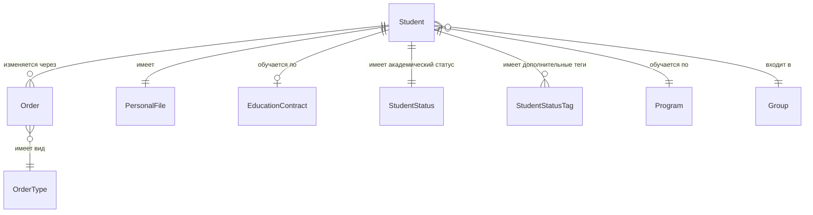

# D05: Модель данных — сущности

## Обучающийся (Student)

| Атрибут | Тип | Описание | Источник |
|---|---|---|---|
| id | UUID | Внутренний идентификатор | ИС |
| last_name | string | Фамилия | Личное дело |
| first_name | string | Имя | Личное дело |
| middle_name | string? | Отчество | Личное дело |
| snils | string | СНИЛС | Документ |
| birth_date | date | Дата рождения | Паспорт |
| citizenship | enum | РФ / ЕАЭС / иное | Документ |
| status_id | FK→StudentStatus | Текущий академический статус | Приказ |
| financing | enum | бюджет / договор / целевое | Приказ / договор |
| enrollment_date | date | Дата зачисления | Приказ о зачислении |
| program_id | FK→Program | Образовательная программа | Приказ |
| course | int | Курс/год обучения | Расчётный |
| group_id | FK→Group | Учебная группа | УМУ |
| statuses | list[StudentStatusTag] | Множественные статусы (соц., фин., воинск.) | Разные источники |

## Таксономия статусов обучающегося

Статусы разделяются на **академический статус** (один, определяет факт обучения)
и **дополнительные теги** (несколько одновременно, описывают характеристики).

### Академический статус (StudentStatus)

| Код | Название | Срочность |
|---|---|---|
| APPLICANT | Абитуриент | До зачисления |
| ENROLLED | Зачислен (активный) | Бессрочный |
| INDIVIDUAL_PLAN | Обучение по ИУП | Срочный |
| TRANSFERRED_COURSE | Переведён на следующий курс/программу | Бессрочный |
| ACADEMIC_LEAVE | Академический отпуск | Срочный |
| ACADEMIC_LEAVE_CHILD | Акад. отпуск по уходу за ребёнком | Срочный |
| REINSTATED | Восстановлен | Бессрочный |
| GIA_EXTERN | Прикреплён для сдачи ГИА | Срочный |
| EXPELLED_GRADUATE | Отчислен в связи с получением образования | Бессрочный |
| EXPELLED_OWN | Отчислен по собственному желанию | Бессрочный |
| EXPELLED_ACADEMIC | Отчислен за неуспеваемость | Бессрочный |
| EXPELLED_CONTRACT | Отчислен за невыполнение условий договора | Бессрочный |
| EXPELLED_DISCIPLINE | Отчислен как мера дисциплинарного взыскания | Бессрочный |
| EXPELLED_RESTORABLE | Отчислен с правом восстановления | Срочный |
| ARCHIVED | В архиве | Бессрочный |

### Теги — финансовый статус

| Тег | Описание | Срочность |
|---|---|---|
| BUDGET | Бюджет | Бессрочный* |
| CONTRACT | Договор (платно) | Срочный |
| TARGET_CONTRACT | Целевой договор | Срочный |
| TARGET_VIOLATED | Нарушил целевой договор | Бессрочный |

### Теги — стипендиальный статус

| Тег | Описание | Срочность |
|---|---|---|
| STIPEND_ACADEMIC | Академическая стипендия | Срочный |
| STIPEND_SOCIAL | Социальная стипендия | Срочный |
| STIPEND_NAMED | Именная / повышенная стипендия | Срочный |

### Теги — социальный статус

| Тег | Описание | Объект привязки | Срочность |
|---|---|---|---|
| DISABILITY_1 / _2 / _3 | Инвалид I/II/III группы | Физлицо | Срочный |
| ORPHAN | Сирота | Физлицо | Бессрочный |
| LARGE_FAMILY | Из многодетной семьи | Физлицо | Бессрочный |
| LOW_INCOME | Малоимущий | Физлицо | Срочный |
| VETERAN | Ветеран боевых действий | Физлицо | Бессрочный |
| PREGNANT | Беременная | Физлицо | Срочный |
| PARENT | Родитель | Физлицо | Бессрочный |
| DISABILITY_HIA | Лицо с ОВЗ | Физлицо | Срочный |

### Теги — миграционный статус

| Тег | Описание | Срочность |
|---|---|---|
| FOREIGNER_VNZh | Иностранный гражданин (ВНЖ) | Срочный |
| FOREIGNER_RVP | Иностранный гражданин (РВП) | Срочный |
| FOREIGNER_VISA | Иностранный гражданин (виза) | Срочный |
| COMPATRIOT | Соотечественник | Бессрочный |

### Теги — воинский учёт

| Тег | Описание | Срочность |
|---|---|---|
| MILITARY_OBLIGATED | Военнообязанный | Бессрочный* |
| MILITARY_EXEMPT | Не военнообязанный | Бессрочный |
| MILITARY_DEFERRAL | Имеет отсрочку от призыва | Срочный |

### Теги — статус общежития

| Тег | Описание | Срочность |
|---|---|---|
| DORM_NEEDED | Нуждается в общежитии | Срочный |
| DORM_PROVIDED | Предоставлено общежитие | Срочный |
| DORM_EXPELLED | Выселен из общежития | Бессрочный |
| DORM_BANNED | Лишён права на общежитие | Срочный/Бессрочный |

### Теги — статус документов

| Тег | Описание | Срочность |
|---|---|---|
| DIPLOMA_ISSUED | Диплом выдан | Бессрочный |
| DIPLOMA_HONORS | Диплом с отличием | Бессрочный |
| DIPLOMA_DUPLICATE | Дубликат документа выдан | Бессрочный |

---

## Классификатор приказов по контингенту

> Источник: `framework.univercon.aplicon.ru/docs/students/database/list_of_orders.md`

### Блок А · Начало образовательных отношений

| Код | Вид приказа |
|---|---|
| ENROLL_MAIN | Зачисление на обучение по основным ОП |
| ENROLL_TRANSFER_IN | Зачисление в порядке перевода из другой ОО |
| ENROLL_EXTERN | Зачисление экстерна для сдачи промежуточной и ГИА |
| REINSTATE_AFTER_EXPEL | Восстановление после отчисления |
| REINSTATE_AFTER_LEAVE | Возвращение из академического отпуска |

### Блок Б · Академическая мобильность

| Код | Вид приказа |
|---|---|
| CHANGE_PROGRAM | Перевод на другую образовательную программу |
| CHANGE_FORM | Перевод на другую форму обучения |
| TRANSFER_COURSE | Перевод на следующий курс |
| CHANGE_FINANCING | Изменение способа возмещения затрат (бюджет/договор) |
| IUP_GRANT | Перевод на индивидуальный учебный план |
| IUP_CANCEL | Прекращение обучения по ИУП |
| ACCELERATED | Организация ускоренного обучения |
| EXTERN_CREDITS | Зачёт результатов обучения экстернов |
| PRACTICE_STUDY | Направление на учебную практику |
| PRACTICE_PRODUCTION | Направление на производственную практику |
| PRACTICE_PREDIPLOM | Направление на преддипломную практику |

### Блок В · Академические и социальные отпуска

| Код | Вид приказа |
|---|---|
| ACADEMIC_LEAVE_GRANT | Предоставление академического отпуска |
| ACADEMIC_LEAVE_EXTEND | Продление академического отпуска |
| ACADEMIC_LEAVE_EARLY | Досрочный выход из академического отпуска |
| MATERNITY_LEAVE | Отпуск по беременности и родам |
| CHILD_CARE_LEAVE | Отпуск по уходу за ребёнком |
| CHILD_CARE_RETURN | Выход из отпуска по уходу за ребёнком |

### Блок Г · Завершение образовательных отношений

| Код | Вид приказа |
|---|---|
| GIA_ADMIT | Допуск к государственной итоговой аттестации |
| VKR_TOPICS | Утверждение тем выпускных квалификационных работ |
| VKR_SUPERVISORS | Утверждение руководителей ВКР |
| EXPEL_GRADUATE | Отчисление в связи с получением образования |
| EXPEL_OWN | Отчисление по собственному желанию |
| EXPEL_ACADEMIC | Отчисление за неуспеваемость |
| EXPEL_CONTRACT | Отчисление за невыполнение условий договора |
| EXPEL_DISCIPLINE | Отчисление как мера дисциплинарного взыскания |

### Блок Д · Административно-организационные процедуры

| Код | Вид приказа |
|---|---|
| CHANGE_NAME | Изменение ФИО |
| CHANGE_CITIZENSHIP | Изменение гражданства |
| CHANGE_PASSPORT | Изменение паспортных данных |
| DOC_DIPLOMA | Выдача диплома и приложения |
| DOC_DIPLOMA_DUPLICATE | Выдача дубликата документа об образовании |
| DOC_STUDENT_CARD_DUP | Выдача дубликата студенческого билета |
| DOC_GRADEBOOK_DUP | Выдача дубликата зачётной книжки |
| DORM_CHECKIN | Заселение в общежитие |
| DORM_TRANSFER | Переселение в общежитии |
| DORM_CHECKOUT | Выселение из общежития |

### Блок Е · Стимулирование и дисциплина

| Код | Вид приказа |
|---|---|
| STIPEND_ACADEMIC | Назначение государственной академической стипендии |
| STIPEND_SOCIAL | Назначение государственной социальной стипендии |
| STIPEND_PRESIDENT | Назначение стипендии Президента / Правительства РФ |
| MATERIAL_AID | Оказание материальной помощи |
| STATE_SUPPORT_FULL | Полное государственное обеспечение |
| DISCIPLINE_REMARK | Дисциплинарное взыскание: замечание |
| DISCIPLINE_REPRIMAND | Дисциплинарное взыскание: выговор |
| DISCIPLINE_LIFT | Снятие дисциплинарного взыскания |

### Блок Ж · Организационное обеспечение

| Код | Вид приказа |
|---|---|
| COMMISSION_GEC | Формирование государственной экзаменационной комиссии |
| COMMISSION_APPEAL | Формирование апелляционной комиссии |
| COMMISSION_TRANSFER | Формирование комиссии по переводам и восстановлениям |

### Блок З · Корректировка и отмена приказов

| Код | Вид приказа |
|---|---|
| ORDER_AMEND_TECH | Исправление технической ошибки в приказе |
| ORDER_AMEND_DETAILS | Изменение реквизитов приказа |
| ORDER_AMEND_SUPPLEMENT | Дополнение приказа |
| ORDER_CANCEL_CIRCUMSTANCES | Отмена приказа в связи с изменением обстоятельств |
| ORDER_CANCEL_VIOLATION | Отмена приказа в связи с выявлением нарушений |
| ORDER_CANCEL_COURT | Отмена приказа по решению суда или вышестоящих органов |

---

## ERD (концептуальная схема)

