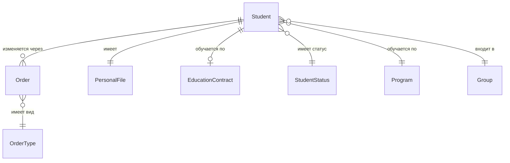

# D05: Модель данных — сущности

## Обучающийся (Student)

| Атрибут | Тип | Описание | Источник |
|---|---|---|---|
| id | UUID | Внутренний идентификатор | ИС |
| last_name | string | Фамилия | Личное дело |
| first_name | string | Имя | Личное дело |
| middle_name | string? | Отчество | Личное дело |
| snils | string | СНИЛС | Документ |
| birth_date | date | Дата рождения | Паспорт |
| status_id | FK→StudentStatus | Текущий статус | Приказ |
| enrollment_date | date | Дата зачисления | Приказ о зачислении |
| program_id | FK→Program | Образовательная программа | Приказ |
| financing | enum | бюджет / договор / целевое | Приказ / договор |
| course | int | Курс/год обучения | Расчётный |
| group_id | FK→Group | Учебная группа | УМУ |

## Статус обучающегося (StudentStatus)

| Код | Название |
|---|---|
| ENROLLED | Зачислен |
| ACADEMIC_LEAVE | Академический отпуск |
| TRANSFERRED_OUT | Переведён (убыл) |
| TRANSFERRED_IN | Переведён (прибыл) |
| EXPELLED_GRADUATE | Отчислен в связи с выпуском |
| EXPELLED_OWN | Отчислен по собственному желанию |
| EXPELLED_ACADEMIC | Отчислен за неуспеваемость |
| EXPELLED_DISCIPLINE | Отчислен дисциплинарно |
| REINSTATED | Восстановлен |
| ARCHIVED | В архиве |

## Вид приказа (OrderType)

| Код | Название |
|---|---|
| ENROLL | О зачислении |
| EXPEL | Об отчислении |
| TRANSFER | О переводе |
| ACADEMIC_LEAVE_GRANT | О предоставлении академотпуска |
| ACADEMIC_LEAVE_RETURN | О выходе из академотпуска |
| REINSTATE | О восстановлении |
| CHANGE_FINANCING | О переводе с бюджета на договор / обратно |
| CHANGE_PROGRAM | О переводе на другую программу |
| GRADUATE | О выпуске |

## ERD (Mermaid)

