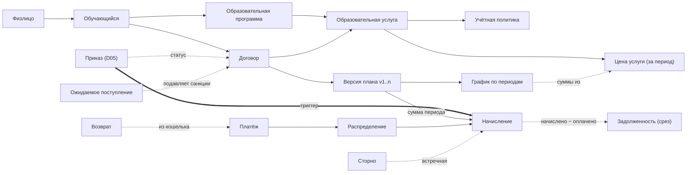

# D09 · Модель данных: учёт договоров на платные образовательные услуги

Платформонезависимая модель данных среза D09 «учёт договоров». Описывает сущности, их
поведение, связи, инварианты и ключевые алгоритмы. Реализация на конкретной платформе
(виды объектов, регистры) — вне рамок фреймворка (см. репозиторий-референс реализации).

---

## 1. Несущие принципы

Модель построена на событийной парадигме — той же, что и учебный контур (D05), поэтому
контуры стыкуются без швов:

- **Состояние меняется только событием (приказом).** Прямого редактирования данных нет.
- **Факт неизменяем.** Начисление, платёж, возврат, ценовая запись после возникновения не
  правятся и не удаляются.
- **Коррекция — встречная запись (сторно), а не правка.** Ошибочный факт гасится
  сторно-записью со ссылкой на исходную; нетто вычисляется.
- **Изменения — только вперёд.** Условия меняются новой версией плана с даты вступления;
  периоды, обязательство по которым уже возникло, заморожены.
- **Финансовый контур синхронен с академическим.** Обязательство возникает по событию
  начала оплачиваемого периода, а не по календарю.
- **Система фиксирует, а не решает.** Считает задолженность и сигнализирует о сроках;
  решение о льготе, рассрочке, взыскании — за人ответственным подразделением.

### Две оси, на которых держится модель

- **План ↔ Факт.** План — договор, график, плановая сумма, цена договора (намерение,
  может версионироваться). Факт — начисления, платежи (реальность, заморожен).
- **Версии плана во времени.** Договор — версия 1; каждое изменение условий (допсоглашение,
  индексация, приказ) — новая версия, действующая вперёд. Действующий план на дату =
  договор + все версии с датой вступления ≤ этой даты.

---

## 2. Сущности

Сгруппированы по контурам. Полные академические сущности (траектория, зачётная книжка,
перезачёт) принадлежат D05 — здесь только граница.

### 2.1 НСИ и правила

| Сущность | Назначение | Ключевые атрибуты | Связи |
|---|---|---|---|
| Образовательная услуга | Что продаётся; точка схождения академики, цены и политики | программа, форма возмещения, вид образования, тип шаблона | ← Договор; 1→N Цена |
| Цена услуги | Цена услуги **за конкретный период обучения** | услуга, период, сумма, единица, дата вступления, основание-приказ | неизменяема; история цен |
| Вид образования | Носитель каскада учётной политики | наименование | ← Услуга, Политика |
| Учётная политика | Конфигурируемые параметры расчёта | уровень каскада, параметр, значение, дата действия | каскад: услуга > вид > организация |
| Тип / версия шаблона договора | Версионируемый текст договора | тип, дата вступления, текст | слепок в версии плана v1 |
| Категория обучающихся | Основание льготы (отдельное измерение) | тип, правило применения, модификатор, срок действия | ← начисление |
| Период обучения | Измерение времени учёбы | тип (год/семестр), границы | используется в ценах, графике, начислениях |

**Цена всегда периодная.** «Целиком» — вырожденный случай одного периода: короткий курс =
одна ценовая запись, длинная программа = по записи на семестр/год. Полная стоимость
договора — не отдельный реквизит, а сумма периодных цен. Переопределение цены — на двух
уровнях: в прейскуранте (новая ценовая запись, для будущих договоров) и в договоре (новая
версия плана, для конкретного). В обоих случаях переопределяется конкретный период
конкретной услуги — поэтому длинная услуга индексируется частями, а короткая целиком.

### 2.2 Договорной контур

| Сущность | Назначение | Ключевые атрибуты | Связи |
|---|---|---|---|
| Договор | Долгоживущая ось денег; план v1 | номер, обучающийся, услуга, дата начала обучения, стороны | 1→N Версия плана; ← все факты |
| Стороны договора | Роли, которые могут принадлежать разным лицам | обучающийся, заказчик, плательщик(и) [± доли] | ← платёж, первичка |
| Версия плана | Изменение условий (v1=заключение, v2…n) | договор, № версии, дата вступления, основание (ДС/индексация/приказ), график [период, сумма], слепок шаблона (v1), категория | источник суммы для начисления |
| График по периодам | Производный план: когда и сколько ожидается | период, сумма (из периодных цен) | снимок на версию; полная сумма — итог |

**Договор** — предусловие зачисления: зачисление невозможно без заключённого договора (при
этом договор может быть ещё не оплачен). Сам договор не редактируется — изменяется только
новой версией плана. Версия умеет не только переоценивать будущие периоды, но и **добавлять
период** (повторное обучение); полная сумма как итог графика растёт сама.

### 2.3 Финансовый контур

| Сущность | Назначение | Ключевые атрибуты | Поведение |
|---|---|---|---|
| Начисление | Обязательство за период (факт) | договор, период, сумма, версия-источник, событие-основание, дата вступления триггера | возникает по триггеру; снимает сумму с версии на дату вступления; блокируется |
| Платёж | Поступление денег (факт) | плательщик, договор (может быть пуст), сумма, дата, источник/инструмент, внешний ИД | идемпотентен по внешнему ИД |
| Распределение | Привязка платежа к начислениям | платёж, начисление, сумма | гасит долг; FIFO по умолчанию, в пределах договора |
| Возврат средств | Движение денег обратно (не сторно) | договор, плательщик, сумма, основание, инициатор | отдельная неизменяемая запись |
| Ожидаемое поступление | Гарантия (маткапитал/кредит) | договор, сумма, источник, статус, срок | подавляет санкции, долг не гасит |
| Сторно | Встречная запись к ошибочному факту | исходный факт, причина | один факт — одно действующее сторно |
| Академическое событие | Сигнал из D05 (триггер) | договор/обучающийся, тип, дата вступления, дата приказа, внешний ИД | идемпотентно; не доверяется вслепую |

**Платёж сам по себе не гасит долг — его гасит распределение.** Платёж поступает на
«кошелёк» плательщика; распределение переносит сумму в «оплачено» против конкретных
начислений; возврат выводит деньги наружу. Платёж без распределения допустим (суспенс).
**Задолженность** = начислено − оплачено — производная величина, не хранится.

---

## 3. Жизненный цикл договора

Состояния: **Проект → Заключён → Действует → (Приостановлен) → Расторгнут / Исполнен**.

- **Проект → Заключён** — подписание договора.
- **Проект → Аннулирован** — зачисление не состоялось (начислений не было; не путать с
  расторжением).
- **Заключён → Действует** — приказ о зачислении; дата начала обучения = триггер первого
  начисления.
- **Действует** — события начала периода (перевод / условный перевод / повтор) порождают
  начисления; изменения условий создают новые версии плана; принимаются платежи.
- **Действует ↔ Приостановлен** — академотпуск замораживает новые начисления (долг
  сохраняется); возврат из отпуска возобновляет.
- **→ Расторгнут** — отчисление; запускается алгоритм возврата.
- **Расторгнут → Действует** — отмена приказа об отчислении (сторно события); начисления
  восстанавливаются только за реально оказанные периоды, не автоматически.
- **→ Исполнен** — выпуск.

**Две оси закрытия.** Академическое расторжение прекращает начисления, но **финансово
договор остаётся открытым, пока сальдо ≠ 0** (идёт взыскание долга или оформляется
возврат). Финансовое закрытие — отдельное событие при сальдо = 0.

---

## 4. Стык с академическим контуром (D05)

Обязательства следуют за приказами. Реакция финансового контура однозначна для каждого
типа события:

| Академическое событие (D05) | Реакция финансового контура |
|---|---|
| Зачисление | Требует существующего договора; дата начала → 1-е начисление |
| Перевод / условный перевод | Триггер начисления следующего периода |
| Оставление на повторное обучение | Версия плана добавляет период; триггер начисления |
| Академотпуск | Договор → «Приостановлен»; начисления заморожены |
| Возврат из отпуска | Возобновление; смена редакции учебного плана → смена услуги |
| Отчисление | Договор → «Расторгнут»; алгоритм возврата; причина → правило возврата |
| Отмена отчисления | Реверс статуса; начисления только за оказанное |
| Восстановление | Новый договор — новая финансовая ветка |
| Нет перевода (академдолг) | Нет события начала периода → нет начисления |

Событие датируется **датой вступления в силу** (не датой приказа); приказы часто
оформляются задним числом, поэтому событие может прийти позже и с ранней датой — это
обрабатывается через сторно и повторный расчёт, без правки факта.

---

## 5. Инварианты

То, что система запрещает независимо от интерфейса и действий пользователя — граница между
«корректной моделью» и «системой, которую нельзя сломать».

**Факт и неизменяемость**
- Факт не редактируется и не удаляется; изменение — только встречной записью (сторно).
- Сторно ссылается ровно на один факт; повторное сторно уже сторнированного запрещено.
- Сторно-запись сама не сторнируется и не редактируется.

**Деньги и распределение**
- Сумма распределений платежа ≤ суммы платежа.
- Распределение ссылается на существующее несторнированное начисление.
- Распределение — строго внутри своего договора; междоговорное движение — только явный перенос.
- Платёж без распределения допустим (суспенс); начисление без оплаты допустимо (долг).
- Отрицательный долг из дубля платежа невозможен (идемпотентность).

**План и версии**
- Версия плана не изменяет период, чей триггер уже сработал.
- Версии упорядочены; при равной дате вступления порядок — по номеру.
- Начисление снимает сумму с версии, действующей на дату вступления триггера.

**События**
- Один приказ = одно финансовое событие (идемпотентность).
- Платёж уникален по внешнему идентификатору.
- Событие-триггер обязано ссылаться на договор или обучающегося.

**Жизненный цикл**
- Переходы статусов — только по разрешённой матрице.
- В «Проекте» и «Приостановлен» новые начисления не порождаются.
- Договор не закрывается финансово, пока сальдо ≠ 0.

**Закрытый период**
- Факт в закрытом периоде не сторнируется и не изменяется автоматически.
- Коррекция закрытого периода — управляемой записью в текущем открытом периоде, без
  каскадного пересчёта прошлого.
- Ценовая запись, на которую сослалось начисление, не сторнируется.

---

## 6. Ключевые алгоритмы

**Отчисление и возврат за незавершённый период.** Один алгоритм на три случая (отчисление
в середине периода, после условного перевода, частично оплаченный период):
1. начисление незавершённого периода сторнируется и заменяется новым — на фактически
   оказанный объём (по единице расчёта возврата);
2. начисления не начавшихся периодов сторнируются в ноль;
3. затем сверка с распределёнными платежами: переплата → возврат, недоплата → долг.
Если единица расчёта деятельностная (ЗЕ, занятие), а данных нет — расчёт блокируется с
сигналом (либо параметром падает на календарное правило).

**Перераспределение при сторно начисления.** Сторно освобождает распределения; платежи
возвращаются в нераспределённые и FIFO прогоняется заново по актуальным начислениям.

**Единица расчёта возврата** определяет источник истины об оказанном объёме: календарная
(день/месяц/период) → автомат (функция от дат); деятельностная (занятие/ЗЕ) → журнал.

**Фиксация цены предоплатой** — пропорционально оплаченной доле: оплаченная доля периода
закрепляется по версии на дату платежа, неоплаченная индексируется при срабатывании
триггера.

---

## 7. ERD (mermaid)

---

*Полная концепция (фундамент, операционные алгоритмы, инварианты, карта стыков контуров) —
в исходных материалах пакета. Реализация на 1С — в отдельном референсе, вне фреймворка.*
